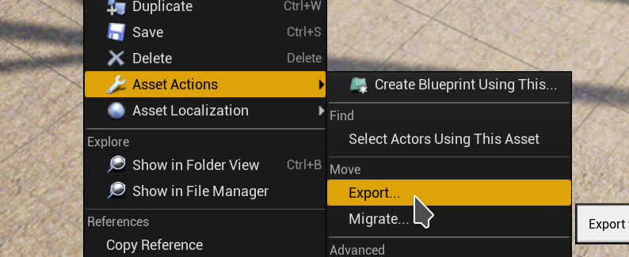
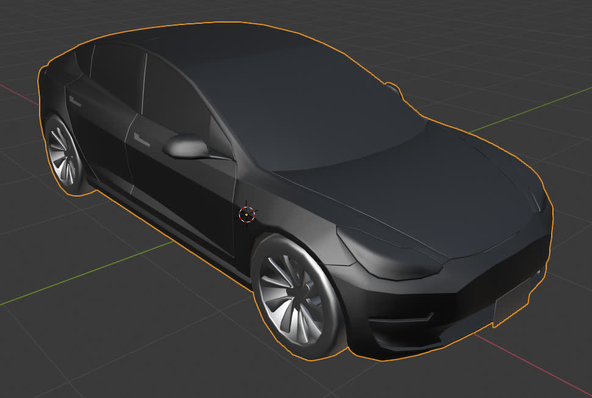

# Modifying the Vehicle Model

You may be interested in adding novel features to the vehicle mesh itself, outside of what we have provided with DReyeVR. In this guide, we'll help you get familiar with some of the tools and basic requirements to do so, along with an example of how we modified the vanilla CARLA Tesla static mesh to have a dynamic steering wheel. 

Note that to continue, we assume you have access to the following software:
- Unreal Engine Editor
- Carla (from source)
- Blender ([Download free](https://www.blender.org/download/))

## Getting started
The first place to look would definitely be CARLA's own excellent guide on [adding custom vehicles](https://carla.readthedocs.io/en/latest/tuto_A_add_vehicle/) if you already have one in mind. But it is still a good read to understand the underlying mechanisms at play to achieve a viable CARLA/UE4 vehicle:
- [Bones](https://docs.unrealengine.com/4.27/en-US/AnimatingObjects/SkeletalMeshAnimation/Persona/VirtualBones/): A bone can be thought of as a rigging entity, allowing for attachments between entities to be rigid and constrained. 
- [Skeleton](https://docs.unrealengine.com/4.26/en-US/AnimatingObjects/SkeletalMeshAnimation/Skeleton/): A skeleton contains the location and orientation of bones and their hierarchy. 
- [Physics Mesh](https://docs.unrealengine.com/4.26/en-US/InteractiveExperiences/Physics/PhysicsAssetEditor/): Denotes the bounding boxes around important features of the mesh. Primarily used for collision detection. 
- [Animation](https://docs.unrealengine.com/4.27/en-US/AnimatingObjects/SkeletalMeshAnimation/AnimBlueprints/): Animation blueprints control the animation of a skeletal mesh typically through some state-machine logic.
- [Blueprint](https://docs.unrealengine.com/4.27/en-US/ProgrammingAndScripting/Blueprints/UserGuide/Types/ClassBlueprint/): Combines all of the above into a highly dynamic and flexible UObject that can serve as our Vehicle agent. 

With all this in mind, you are probably going to be interested in:
- Blueprints: `$CARLA_ROOT/Unreal/CarlaUE4/Content/Carla/Blueprints/Vehicles/XYZ`
- Other: `$CARLA_ROOT/Unreal/CarlaUE4/Content/Carla/Static/Vehicles/4Wheeled/XYZ`

# Example: Adding a dynamic steering wheel
Problen: It is quite jarring to drive without a responsive steering wheel, and since the Carla vehicle meshes were not designed for human drivers, there is no need to separate the steering wheel from the overall vehicle shell. This is problematic since the wheel is now a part of the vehicle mesh and cannot be animated during runtime. 

In our case, we elected to use the TeslaM3 mesh for our base class, so we'll be working with that here too. 

Our plan of action will be:
1. Extract the steering wheel mesh from the vehicle and create its own static mesh
2. Update the vehicle mesh to remove the steering wheel 
3. Re-attach the steering wheel back as a code-based dynamic object

For steps 1 & 2, we will be using the free & open source Blender program for the 3D modeling work:

## 1. Extract the steering wheel

### Exporting to FBX
First, go to the static mesh file you wish to export, in our case we wanted to export `$CARLA_ROOT/Unreal/CarlaUE4/Content/Carla/Static/Vehicles/4Wheeled/Tesla/SM_TeslaM3_v2.uasset` (notice these files should have a pink underline to indicate they are the full static mesh files). 

### One LOD
I recommend using the highest LOD ([Level-Of-Detail](../LODS.md)) setting for this export, since this vehicle will be so close to the camera all the time it is pointless to have multiple LOD's, and it makes it simpler for the import to blender. 

To do this, simply enter the static mesh by double clicking it, and on the left "Asset Details" pane, down in "LOD Settings" drag the "Number of LODs" slider down to 1, then click "Apply Changes" as follows. 
- 

### Export to blender
Now, back in the `Content Browser` you can right click the file then select `Asset Actions -> Export` and designate a place for the resulting `.FBX` file to be exported. 
- 

### Model in Blender
Now, open a fresh Blender window and delete the default spawned cube. Then go to `File -> Import -> FBX (.fbx)` and select the file you just created. 

You should now be presented with a simple Blender window with the vehicle like this:
- 

In order to toggle moving around using `WASD` controls, press `shift + ` `. Move inside the vehicle where you can find the steering wheel. 

The easiest way (I've found) to efficiently extract the steering wheel it so use the wireframe-mode to select all vertices, even those that aren't visible in the solid render. To go to wireframe mode press `z` then select `wireframe` (should be the left-most option). Then you should see something like this:
- 

Then, to actually select the proper vertices, we're going to need to change from `Object Mode` to `Edit Mode` in the top left corner of the viewport. Then we'll need to position our camera in such a way to minimize unwanted vertices being selected, and use whatever selection technique we want (I like the lasso selection) to select the entire steering wheel like this:
- 
NOTE: if you have excess vertices selected, you can always undo those with `shift+click` on individual vertices.

Then, you should be able to move the entire bunch out of the vehicle (or duplicate them all with `shift+d` and clean up the original) to have something like this:
| Wireframe | Rendered |
| --- | --- |
|  |  | 

Finally, you should then be able to export the individual selections (need to export both the just-wheel and the just-vehicle models) by selecting all the vertices the same way (in wireframe) and deleting them (then undo-ing the deletion of course). Then selecting `File -> Export -> FBX(.fbx)` for best compatibility. Do this for both the Vehicle mesh as well as the steering wheel (I moved the steering wheel to the origin when exporting but I'm not sure this is necessary). 

## 2. Update the vehicle mesh

### Back in the Editor
Now, back in the editor, we'll create a new directory for both the Vehicle mesh as well as the steering wheel. Most of the content from this section is a modified version of the [Carla-provided documentation](https://carla.readthedocs.io/en/latest/tuto_A_add_vehicle/).

Then, in the new `Mesh` directory, we can simply right-click in the content browser and select `Import Asset` then select our FBX model. Make sure to set **Import Content Type** to `Geometry and Skinning Weights`, **Normal Import Method** to `Import Normals`, and **Material Import Method** to `Do not create materials`,  and finally uncheck **Import Textures**.

We should now have a (pink underlined) Skeletal mesh asset, (beige underlined) physics asset, and (baby blue underlined) skeleton asset. Then, right click on the new (pink underlined) skeletal mesh asset and select `Create -> Anim Blueprint` to create a new animation blueprint. 

In this animation blueprint, ensure the following:
- Go to `Class settings -> Details -> Class Options -> Parent Class` and reparent the class to a `VehicleAnimInstance`. 
- In the `My Blueprint` section, click on `AnimGraph` and copy over the same graph logic from the existing `TeslaM3` animation to look like this:

| Reparent | Animation | 
| --- | --- | 
|  |  | 

Now you are done with the animation blueprint.

In my experience I had to do some additional tweaking to use the right components for my overall mesh (pink underlined) as follows:
- `Asset Details -> Physics Asset`: Replace new with the existing `$CARLA_ROOT/Unreal/CarlaUE4/Content/Carla/Static/Vehicles/4Wheeled/Tesla/SM_TeslaM3_PhysicsAsset.uasset` physics asset (NOT the `_v2_` model!)
- `Asset Details -> Lighting`: Same as the Physics Asset
- `Preview Scene Settings -> Animation Blueprint`: The new animation blueprint you just created. 

Then finally, you can delete the newly imported PhysicsAsset file since it is no longer being used (I opted to use the vanilla TeslaM3 one instead)

And in `BP_EgoVehicle_DReyeVR`, you can finally edit the `Mesh (Inherited) -> Details -> Mesh` field to use the new SM we just updated (pink underline). Since this clears the `Animation` section, you'll also need to update the `Mesh (Inherited) -> Animation -> Anim Class` field to use the new animation class we just made. 

Now the DReyeVR EgoVehicle should be fully drivable and operates just as it did before, but now with no steering wheel in the driver's seat!


## 3. Re-attach the steering wheel dynamically
### Import to UE4
Now we want to import the steering wheel back into the engine so we can dynamically spawn, place, and update it at runtime. 

The easiest way to do this is through importing the SteeringWheel `.fbx` just like with the Vehicle mesh, from there it should have all the original textures pre-applied and be slightly angled. 

To get rotations of the wheel to be in the Roll axis of the wheel itself (not its attachment), I recommend slightly tilting the static mesh wheel so that it is mostly vertical and select `Make Static Mesh`. 

This will allow you to create a plain simple static mesh (cyan underline) from the skeletal mesh (pink underline) as follows:
| Rotated Skeletal Mesh | Resulting Directory | 
| --- | --- |
|  |  |

### Import in code
Now that we have a reasonable steering wheel model as a simple static mesh, it is easy to spawn it and attach it to the ego-vehicle (currently without a steering wheel) in code. Managing it in code is nice because it will allow us to `SetRelativeRotation` of the mesh dynamically on every tick, allowing it to be responsive to our inputs at runtime. 

The first step to Spawn the steering wheel in code is to find its mesh in the editor. Right click on the static mesh (cyan underline) and select `Copy Reference`. For me it looks like this:
- `StaticMesh'/Game/Carla/Blueprints/Vehicles/DReyeVR/SteeringWheel/SM_SteeringWheel_DReyeVR.SM_SteeringWheel_DReyeVR''`

(Note that we won't be needing any of the other steering wheel assets anymore, feel free to delete them)

The general strategy for adding Unreal components in code is to spawn them in the constructor then use their reference alongside their C++ API. For our case we'll only need a constructor and a tick method:
```c++
// In EgoVehicle.h
////////////////:STEERINGWHEEL:////////////////
void ConstructSteeringWheel(); // needs to be called in the constructor
UPROPERTY(Category = Steering, EditDefaultsOnly, BlueprintReadWrite, meta = (AllowPrivateAccess = "true"))
class UStaticMeshComponent *SteeringWheel;
void TickSteeringWheel(const float DeltaTime);
FVector InitWheelLocation;
FRotator InitWheelRotation;
float MaxSteerAngleDeg;
float MaxSteerVelocity;
float SteeringScale;
```

```c++
// In EgoVehicle.cpp
void AEgoVehicle::ConstructSteeringWheel()
{
    static ConstructorHelpers::FObjectFinder<UStaticMesh> SteeringWheelSM(
        TEXT("StaticMesh'/Game/Carla/Blueprints/Vehicles/DReyeVR/SteeringWheel/"
             "SM_SteeringWheel_DReyeVR.SM_SteeringWheel_DReyeVR'")); // from earlier
    SteeringWheel = CreateDefaultSubobject<UStaticMeshComponent>(FName("SteeringWheel"));
    SteeringWheel->SetStaticMesh(SteeringWheelSM.Object);
    SteeringWheel->SetupAttachment(GetRootComponent()); // The vehicle blueprint itself
    SteeringWheel->SetRelativeLocation(InitWheelLocation);
    SteeringWheel->SetRelativeRotation(InitWheelRotation);
    SteeringWheel->SetGenerateOverlapEvents(false); // don't collide with itself
    SteeringWheel->SetCollisionEnabled(ECollisionEnabled::NoCollision);
    SteeringWheel->SetVisibility(true);
}

void AEgoVehicle::TickSteeringWheel(const float DeltaTime)
{
    const FRotator CurrentRotation = SteeringWheel->GetRelativeRotation();
    const float TargetAngle = GetVehicleInputs().Steering * SteeringScale;
    float DeltaAngle = (TargetAngle - CurrentRotation.Roll);

    // place a speed-limit on the steering wheel
    DeltaAngle = FMath::Clamp(DeltaAngle, -MaxSteerVelocity, MaxSteerVelocity);

    // create the new rotation using the deltas
    FRotator NewRotation = CurrentRotation + DeltaTime * FRotator(0.f, 0.f, DeltaAngle);

    // Clamp the roll amount so the wheel can't spin infinitely
    NewRotation.Roll = FMath::Clamp(NewRotation.Roll, -MaxSteerAngleDeg, MaxSteerAngleDeg);
    SteeringWheel->SetRelativeRotation(NewRotation);
}
```

Now enjoy a responsive steering wheel asset attached to the EgoVehicle as you drive around!